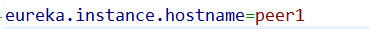

# Eureka高可用出现unavailable-replicas问题的解决方案


参照《Spring Cloud微服务实战》一书搭建eureka高可用时，节点之间互相注册成功，但是，节点均出现在unavailable-replicas，针对该问题，查阅多方资料以及个人测试，总结出来下面几点解决方案，若有同遇到此问题的伙伴，本文可供参考排查错因。

注：本人共有三个配置文件,如下


### 1：spring.application.name

每个application.properties内spring.application.name必须要一致（本人测试不写也是通过了的）

### 2：eureka.client.serviceUrl.defaultZone

该参数在配置地址时，不可使用localhost，应使用域名，DNS解析配置文件在C:\Windows\System32\drivers\etc\hosts文件内


### 3：eureka.client.register-with-eureka: true

eureka.client.fetch-registry: true

这两项若配置，则必须设为true，将自己作为服务向其他注册中心注册自己。
启动服务时虽然采用 --spring.profiles.active = peer1 指定了配置文件，但还是会从 application.properties 中取值，将application.properties的

```properties
eureka.client.register-with-eureka=false
eureka.client.fetch-registry=false
```


注释掉或者 在 application-peer1.properties 与 application-peer2.properties 中指定这两个属性值为true


### 4：eureka.instance.hostname

eureka会自动拉取设备host，各节点在同一机器下时请务必添加，注意各节点配置自己节点的host




### 5：eureka.instance.prefer-ip-address:

该值若配置一定要配置为false!!!
prefer-ip-address: true代表使用IP地址的形式来定义注册中心的地址，而不使用主机名，而defaultZone中是以域名的方式向注册中心注册的，最终导致分片节点不能识别匹配（IP地址与域名），而认为分片均处于不可达状态。
《Spring Cloud 微服务实战》一书中关于该部分说明略隐晦，本小白未能参悟，写此文记录学习所遇困惑亦供参考。

参考：《Spring Cloud 微服务实战》
